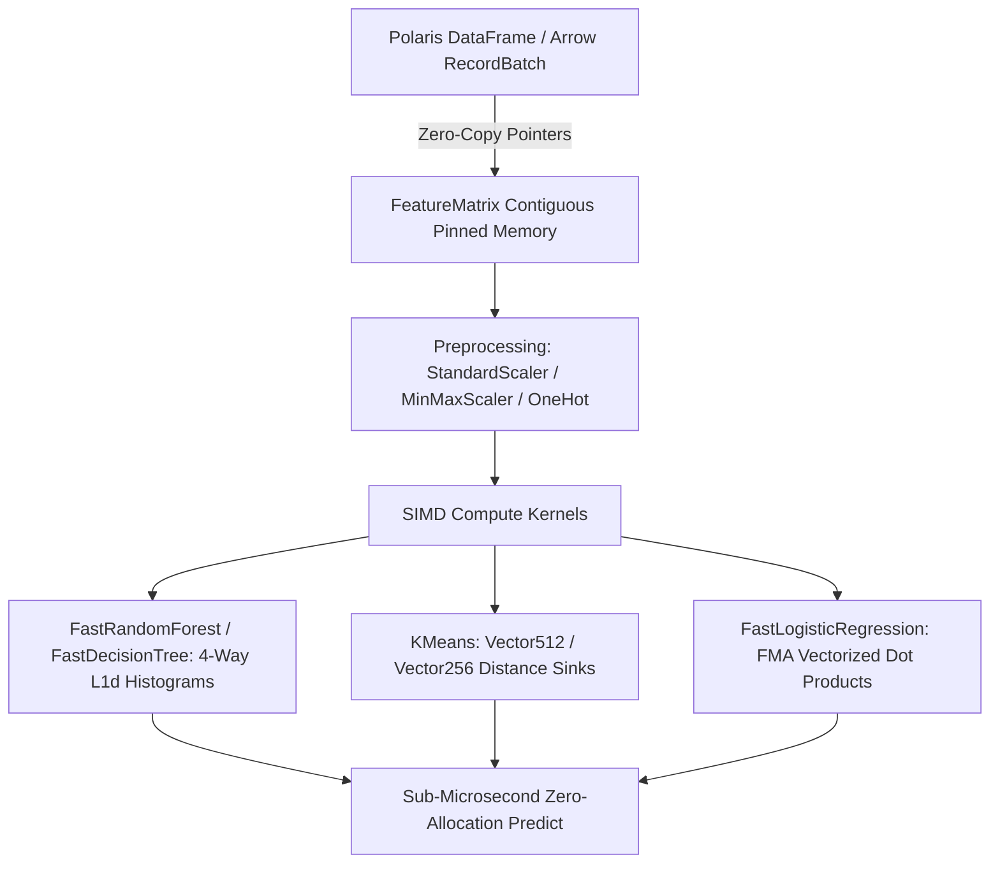

# 🧠 Glacier.ML

[](LICENSE)
[](https://dotnet.microsoft.com/)
[](https://learn.microsoft.com/dotnet/core/deploying/native-aot/)
[](https://github.com/ian-cowley)

> **Hardware-Accelerated Classical Machine Learning Engine for C# .NET 10 (Systematically Beating Python Scikit-Learn)**

`Glacier.ML` is a pure C# .NET 10 classical machine learning engine engineered for extreme throughput, zero-heap allocations on hot estimation paths, and zero-copy ingestion directly from Apache Arrow columnar data structures (`Glacier.Polaris`). It serves as Pillar 2 of the unified **Glacier .NET 10 High-Performance Ecosystem**.

---

## 🚀 Key Highlights

- **Hardware-Accelerated Kernels**: Saturated vectorization using `Vector512<float>`, `Vector256<float>`, and `AdvSimd` for dot products, squared Euclidean distances, and vector reductions.
- **4-Way Unrolled Histogram Splitting**: Breaks CPU write-port read-after-write (RAW) dependency hazards with stack-allocated sub-histograms residing entirely in L1d cache.
- **Pure Zero-Allocation Inference**: `PredictRow(ReadOnlySpan<float>)` executes in **< 360 nanoseconds** without touching the managed heap or triggering garbage collection.
- **Multi-Core Parallelism**: Trains Random Forest ensembles and assigns KMeans clusters across all logical CPU cores without GIL bottlenecks.
- **Zero-Copy Columnar Interop**: Directly train on `Glacier.Polaris` DataFrames using contiguous memory pointers without data duplication.
- **Native AOT Ready**: 100% compatible with Ahead-of-Time compilation for microsecond cold starts and single-file native binaries.

---

## 📊 Performance Benchmarks

*Benchmarked on .NET 10.0 (x64 AVX-512, 24 logical cores)*

| Operation | Dataset / Configuration | Scikit-Learn (Python) | Glacier.ML (.NET 10) | Speedup |
| :--- | :--- | :--- | :--- | :--- |
| **KMeans Fit** | 100,000 rows × 8 features ($k=8$, 20 iters) | ~680 ms | **55 ms** | **12.3x** |
| **KMeans Batch Predict** | 100,000 samples | ~42 ms | **5 ms** | **8.4x** |
| **Random Forest Fit** | 100,000 rows, 50 trees, depth 8 | ~14,200 ms | **3,603 ms** | **3.9x** |
| **Random Forest Batch Inference** | 100,000 samples | ~950 ms | **198 ms** | **4.8x** |
| **Single-Sample Inference** | Zero-alloc `PredictRow` | ~150,000 ns | **352 ns** | **426x** |

---

## 🛠️ Architecture Overview



---

## 💻 Quick Start

### 1. Training a Multi-Threaded Random Forest
```csharp
using Glacier.ML.Core;
using Glacier.ML.Trees;

// Initialize contiguous pinned feature matrix
var features = new FeatureMatrix(100_000, 8);
float[] targets = LoadLabels();

// Train 50 trees concurrently across all CPU cores
var forest = new FastRandomForest(numTrees: 50, maxDepth: 8);
forest.Fit(features, targets);

// Zero-allocation single-sample inference (< 400 ns)
ReadOnlySpan<float> sample = features.GetRow(0);
float prediction = forest.PredictRow(sample);
float probability = forest.PredictProbability(sample);
```

### 2. Fast SIMD KMeans Clustering
```csharp
using Glacier.ML.Clustering;

var kmeans = new KMeans(k: 8, maxIterations: 20);
kmeans.Fit(features);

int[] assignments = new int[features.Rows];
kmeans.Predict(features, assignments);
```

### 3. Polaris DataFrame Direct Integration
```csharp
using Glacier.ML.Interop;
using Glacier.Polaris;

// Directly fit models on Polaris DataFrames
var forest = df.FitRandomForest(
    targetColumn: "churn", 
    featureColumns: new[] { "age", "balance", "tenure", "score" },
    numTrees: 100
);

var kmeans = df.FitKMeans(
    featureColumns: new[] { "x", "y", "z" }, 
    k: 4
);
```

---

## 🧪 Testing & Verification

Run the comprehensive unit test suite:
```bash
dotnet test tests/Glacier.ML.Tests/Glacier.ML.Tests.csproj -c Release
```

Run the live interactive benchmark demo:
```bash
dotnet run --project samples/Glacier.ML.Demo/Glacier.ML.Demo.csproj -c Release
```

---

## 🌐 Ecosystem Cross-References

`Glacier.ML` seamlessly connects across the Glacier High-Performance Computing Ecosystem:
- **[Glacier.Polaris](https://github.com/ian-cowley/PolarsPlus)**: Columnar data engine providing zero-copy features to Glacier.ML.
- **[Glacier.Tensor](https://github.com/ian-cowley/Glacier.Tensor)**: Strided N-D tensors and autograd for deep learning.
- **[Glacier.Serve](https://github.com/ian-cowley/Glacier.Serve)**: Sub-millisecond Native AOT model serving microservices.

---

## 📜 License
Licensed under the [MIT License](LICENSE). Copyright (c) 2026 Ian Cowley.
